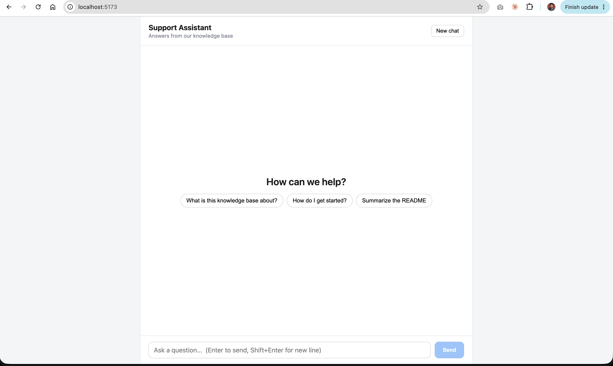

# RAG Support Assistant

A support-chat system that answers questions from a local knowledge base of Markdown files. It uses an **agentic RAG** setup built with LlamaIndex, served through a **FastAPI** backend, with a **React + TypeScript** chat UI.

Built while following the Hugging Face Agents Course, Unit 2.2 (LlamaIndex), section "Creating RAG Agents with QueryEngineTools".



---

## What it does

- Indexes 30+ local `.md` files from `knowledge/` into a vector index.
- Wraps the index's query engine as a **`QueryEngineTool`** so an agent can decide when to search it.
- Exposes the agent over a REST API with **per-session conversation memory**.
- Provides a chat UI with markdown answers, source file chips, suggested questions, and a "New chat" button.

---

## Architecture

```
┌────────────────────┐   /api/chat    ┌─────────────────────────┐
│  React + TS (Vite) │ ─────────────▶ │  FastAPI (uvicorn)      │
│  localhost:5173    │ ◀───────────── │  localhost:8000         │
└────────────────────┘  answer+sources└───────────┬─────────────┘
                                                  │
                                      ┌───────────▼─────────────┐
                                      │ AgentWorkflow (ReAct)   │
                                      │  + Context per session  │
                                      └───────────┬─────────────┘
                                                  │ tool call
                                      ┌───────────▼─────────────┐
                                      │ QueryEngineTool         │
                                      │  "knowledge_base"       │
                                      └───────────┬─────────────┘
                                                  │
                         ┌────────────────────────▼───────────────────────┐
                         │ VectorStoreIndex (persisted in storage/)       │
                         │ built from knowledge/*.md                      │
                         │ embeddings: BAAI/bge-small-en-v1.5 (local)     │
                         └────────────────────────────────────────────────┘

LLM: Qwen/Qwen2.5-Coder-32B-Instruct via Hugging Face Inference API
```

**Request flow**

1. The UI sends `POST /api/chat` with `message` and an optional `session_id`.
2. The backend finds or creates the agent `Context` for that session (this is the conversation memory).
3. The agent runs a ReAct loop: it decides to call `knowledge_base`, retrieves the top 4 chunks, and writes the answer.
4. The backend collects source filenames from the tool-call events and returns `answer`, `sources`, and `session_id`.

---

## Tech stack

| Layer | Technology |
|---|---|
| Language (backend) | Python 3.12 |
| Agent framework | LlamaIndex (`AgentWorkflow`, `QueryEngineTool`, `Context`) |
| LLM | `Qwen/Qwen2.5-Coder-32B-Instruct` via `HuggingFaceInferenceAPI` |
| Embeddings | `BAAI/bge-small-en-v1.5` (`HuggingFaceEmbedding`, runs locally) |
| Vector store | LlamaIndex default in-memory `VectorStoreIndex`, persisted to `storage/` |
| API | FastAPI + Uvicorn, Pydantic models |
| Frontend | React, TypeScript, Vite |
| Markdown rendering | `react-markdown` |
| Styling | Plain CSS (no UI framework) |
| Prototyping | Jupyter Notebook (`rag_agent.ipynb`) |
| Config | `.env` with `python-dotenv` |

---

## Project structure

```
rag-agent/
├── .env                     # HF_TOKEN=hf_xxx (not committed)
├── .venv/                   # Python 3.12 virtual environment
├── knowledge/               # Markdown knowledge base (30+ files)
├── storage/                 # Persisted vector index (auto-created)
├── rag_agent.ipynb          # Original notebook prototype
├── backend/
│   ├── rag.py               # Builds index, query engine, tool, and agent
│   └── main.py              # FastAPI app and endpoints
└── frontend/                # Vite + React + TS app
    ├── vite.config.ts       # Dev proxy: /api -> localhost:8000
    └── src/
        ├── types.ts         # Message, Source, ChatResponse types
        ├── api.ts           # fetch wrappers for the backend
        ├── App.tsx          # Chat UI
        ├── App.css          # Chat styles
        └── index.css        # Global styles
```

---

## Setup

### 1. Backend

```bash
cd rag-agent
python3.12 -m venv .venv
source .venv/bin/activate            # Windows: .venv\Scripts\activate

pip install --upgrade pip
pip install llama-index \
            llama-index-llms-huggingface-api \
            llama-index-embeddings-huggingface \
            sentence-transformers \
            python-dotenv \
            fastapi "uvicorn[standard]" \
            "huggingface_hub<1.0" \
            jupyter ipykernel

python -m ipykernel install --user --name rag-agent --display-name "Python (rag-agent)"
```

Create `.env` in the project root:

```
HF_TOKEN=hf_xxxxxxxxxxxxxxxxxxxxx
```

Tip: once everything works, run `pip freeze > requirements.txt` to lock exact versions.

### 2. Frontend

```bash
cd rag-agent
npm create vite@latest frontend -- --template react-ts
cd frontend
npm install
npm install react-markdown
```

Then add the files listed under `frontend/` in the project structure above.

---

## Running

Two terminals.

```bash
# Terminal 1: backend (run from rag-agent/, venv active)
uvicorn backend.main:app --reload --port 8000

# Terminal 2: frontend (run from rag-agent/frontend)
npm run dev
```

- UI: http://localhost:5173
- API docs (Swagger): http://localhost:8000/docs

The first backend start is slow because it loads the embedding model and, if `storage/` does not exist, builds the index.

---

## API reference

| Method | Path | Description |
|---|---|---|
| `GET` | `/api/health` | Health check, returns `{"status": "ok"}` |
| `POST` | `/api/chat` | Send a message, get an answer with sources |
| `DELETE` | `/api/sessions/{session_id}` | Clear a session's conversation memory |

**`POST /api/chat`**

Request:

```json
{ "message": "How do I get started?", "session_id": null }
```

Response:

```json
{
  "session_id": "b1f1c7f4-...",
  "answer": "To get started, ...",
  "sources": [{ "file": "README.md", "score": 0.812 }]
}
```

Pass the returned `session_id` on follow-up requests to keep the conversation context.

---

## Key configuration points

| What | Where | Notes |
|---|---|---|
| LLM model | `backend/rag.py` | Change `model_name` in `HuggingFaceInferenceAPI` |
| Embedding model | `backend/rag.py` | Changing it requires deleting `storage/` and rebuilding |
| Retrieval depth | `backend/rag.py` | `similarity_top_k=4` |
| Agent behavior | `backend/rag.py` | `SYSTEM_PROMPT` |
| Tool description | `backend/rag.py` | The LLM reads `name` and `description` to decide when to call the tool |
| Suggested questions | `frontend/src/App.tsx` | `SUGGESTIONS` array |
| Allowed origins | `backend/main.py` | CORS list; the Vite proxy avoids CORS in dev |

---

## Updating the knowledge base

The index is persisted, so edits to `knowledge/*.md` are **not** picked up automatically.

```bash
rm -rf storage/
# restart the backend; it rebuilds the index on startup
```

---

## Troubleshooting

**`RuntimeError: Cannot send a request, as the client has been closed`**
Seen on Python 3.14 with the `HuggingFaceInferenceAPI` wrapper. Fixed by recreating the venv on **Python 3.12** and pinning `huggingface_hub<1.0`. Alternative: switch the LLM to `OpenAILike` pointed at `https://router.huggingface.co/v1`.

**`RuntimeError: asyncio.run() cannot be called from a running event loop` (notebook)**
Use top-level `await agent.run(...)` in Jupyter instead of `asyncio.run(...)`.

**401 / 403 from Hugging Face**
`HF_TOKEN` is missing or lacks inference permissions. Check that `.env` is in the project root.

**503 or rate limits on the 32B model**
Serverless inference can be flaky on the free tier. Retry, or test with a smaller model.

**`sources` comes back empty**
The agent answered without calling the tool. Tighten `SYSTEM_PROMPT` and make the tool description specific to your content.

**Poor retrieval on long documents**
Tune chunking, then rebuild the index:

```python
Settings.chunk_size = 512
Settings.chunk_overlap = 50
```

---

## Known limitations

- Sessions live in memory: a backend restart clears all conversations.
- Single worker only: do not use `uvicorn --workers N`, since sessions would be split across processes.
- No authentication or rate limiting on the API.
- Answers are returned in one piece (no streaming), and the ReAct loop makes several LLM calls per question, so responses take a few seconds.
- The vector index is a local file store, which is fine for ~30 files but not for large corpora.
